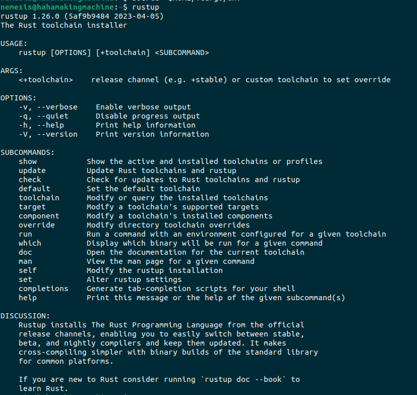

# Rust_Playground
This Repository will contain all the code I write in Rust throughout my learning journey.

## Installing Rust (Linux)
1. Run the following command in the terminal and proceed through the TUI menu.
  ```
  curl --proto '=https' --tlsv1.2 -sSf https://sh.rustup.rs | sh
  ```
2. Enter the following line to source your newly-installed Rust toolchain. This command has to be run only once after installing Rust the first time.
  ```
  source "$HOME/.cargo/env"
  ```
3. Now, to check if everything went okay, enter `rustup` in the terminal and you should see a screen like this:



## Installing Rustlings
For more info about Rustlings, please checkout their [Github repository](https://github.com/rust-lang/rustlings).

This is me testing Git.
